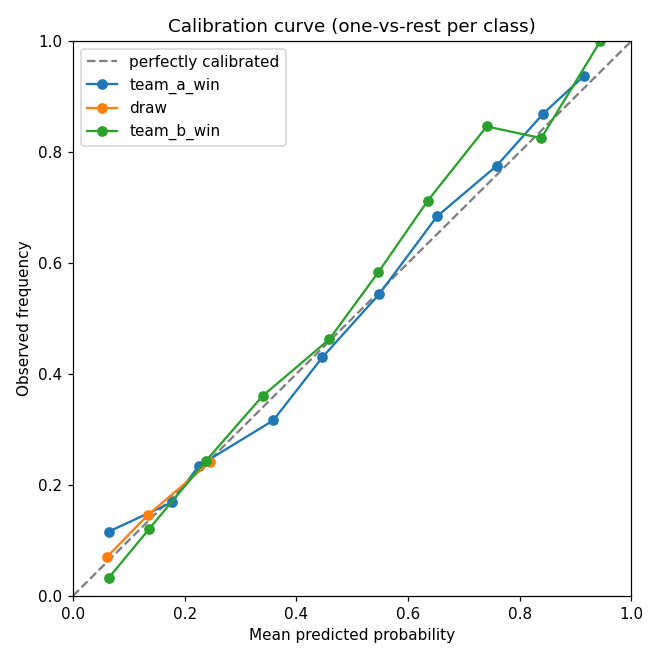
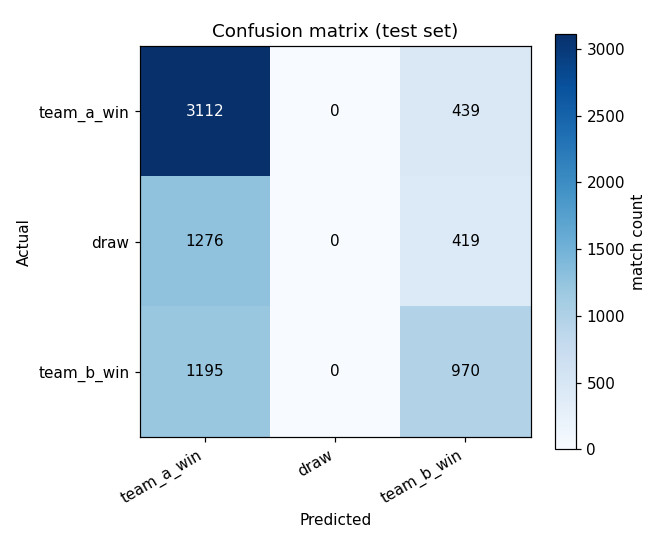

# Model Evaluation Report

Predicting the 3-way outcome of an international football match — **team A win**, **draw**, **team B win** — from leakage-safe, as-of-kickoff features. Every number below is measured on a **temporally held-out test set** of **7,411 matches** the model never saw during training or calibration.

> **Honest framing:** this is a deliberately simple, well-regularized model judged against honest baselines. On the test set it **edges ahead of** the strongest baseline (see below) — a small, real edge, not a dramatic one. It is not state of the art and is not presented as such.

## How to read the metrics

- **Log loss** measures how good the predicted *probabilities* are, not just the yes/no call. It rewards being confident and right, and punishes being confident and wrong very harshly. Lower is better. A model that learns nothing and always predicts the three outcomes as equally likely scores about **1.099** (`ln 3`); a perfect, fully-confident model scores **0**.
- **Brier score** is the average squared distance between the predicted probabilities and what actually happened. Put 100% on the correct result and you score 0; spread your bets and you score somewhere in between. Lower is better (0 is perfect, 2 is the worst possible in a 3-way race).
- **Calibration** asks whether the probabilities mean what they say: of all the matches the model calls *60% likely*, do roughly 60% actually happen? The calibration curve plots predicted probability against the observed rate — the closer it hugs the diagonal, the more honest the numbers. **Expected Calibration Error (ECE)** is the average gap from that diagonal (lower is better), which matters because these probabilities feed a Monte Carlo simulation downstream.

## Metrics summary (test set)

| model | log_loss | brier | accuracy | n |
| --- | --- | --- | --- | --- |
| main_model (calibrated) | 0.9583 | 0.5675 | 0.5508 | 7411 |
| main_model (uncalibrated) | 0.9593 | 0.5686 | 0.5488 | 7411 |
| recent_form_logistic | 0.9637 | 0.5718 | 0.5459 | 7411 |
| weighted_ensemble | 0.9935 | 0.5917 | 0.5186 | 7411 |
| class_frequency | 1.0500 | 0.6332 | 0.4792 | 7411 |
| uniform_random | 1.0986 | 0.6667 | 0.4792 | 7411 |

## Baseline comparison

- Main model (calibrated) test log loss: **0.9583**
- Best baseline test log loss: **0.9637**
- A baseline that beats your model is a useful result too: it tells you the fancy features are not pulling their weight yet.

## Calibration

Expected Calibration Error on the test set: **0.0198** before calibration → **0.0163** after (isotonic scaling). Lower is better.

*Each line is one outcome class (one-vs-rest). Points on the diagonal mean the stated probabilities match reality.*

## Confusion matrix

| actual | team_a_win | draw | team_b_win |
| --- | --- | --- | --- |
| team_a_win | 3112 | 0 | 439 |
| draw | 1276 | 0 | 419 |
| team_b_win | 1195 | 0 | 970 |

*Rows are what actually happened, columns are what the model predicted. Draws are notoriously hard to call in football — expect them to be the weakest row.*

## Class-level performance

| class | precision | recall | f1 | support |
| --- | --- | --- | --- | --- |
| team_a_win | 0.557 | 0.876 | 0.681 | 3551 |
| draw | 0.000 | 0.000 | 0.000 | 1695 |
| team_b_win | 0.531 | 0.448 | 0.486 | 2165 |

## Caveats

- Scores reflect the current feature set only; stronger signals (self-computed Elo, FIFA ranking) are planned and not yet included.
- International football is high-variance; even a good model will look only modestly better than the base rates.
- No hyperparameters were tuned on the test set; it was scored once.
